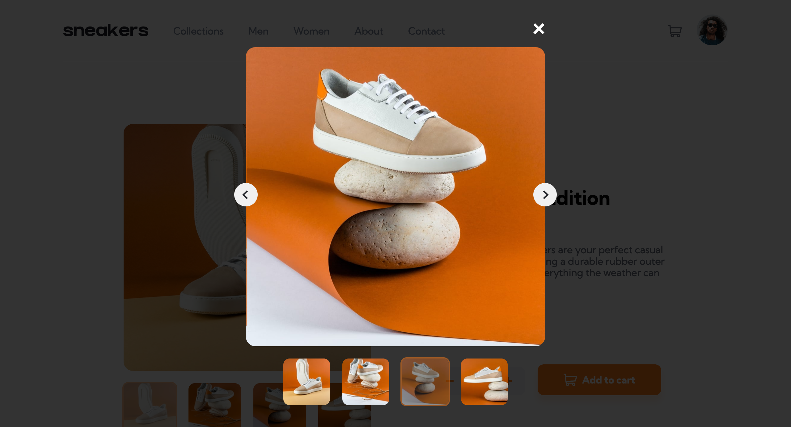

# Frontend Mentor - E-commerce product page solution

This is a solution to the [E-commerce product page challenge on Frontend Mentor](https://www.frontendmentor.io/challenges/ecommerce-product-page-UPsZ9MJp6). Frontend Mentor challenges help you improve your coding skills by building realistic projects.

## Table of contents

- [Overview](#overview)
  - [The challenge](#the-challenge)
  - [Screenshot](#screenshot)
  - [Links](#links)
- [My process](#my-process)
  - [Built with](#built-with)
  - [What I learned](#what-i-learned)
  - [Continued development](#continued-development)
  - [Useful resources](#useful-resources)

**Note: Delete this note and update the table of contents based on what sections you keep.**

## Overview

### The challenge

Users should be able to:

- View the optimal layout for the site depending on their device's screen size
- See hover states for all interactive elements on the page
- Open a lightbox gallery by clicking on the large product image
- Switch the large product image by clicking on the small thumbnail images
- Add items to the cart
- View the cart and remove items from it

### Screenshot

### Links

- Live Site URL: [GitHub Pages](https://reesarthurchmiel.github.io/)

## My process

### Built with

- Semantic HTML5 markup
- CSS variables
- Flexbox
- Mobile-first workflow
- BEM CSS

### What I learnt

I learnt a lot during this project. The most exciting bit for me was using BEM and CSS variables to create a reusable image slideshow component that could be reused with easily changed properties for different situations. I used this slideshow component in both the main page and the lightbox gallery. I also enjoyed learning about CSS transitions, which I used on the mobile navigation pane and the slideshow. Perfecting small details like transitions greatly improve the feel of the UX and made the whole project more polished, which I am really pleased by. Lastly, I learnt a useful trick to re-colour SVG images with the `filter` property, and with the `fill` property. 

### Continued development

Using BEM for this project was a useful strategy to keep my HTML and CSS readable, but I can see that in a larger codebase it would get unwieldy quickly. For future development I would like to learn a component framework, such as React or Vue, and use CSS-in-JS. I have been researching possible options, and Emotion looks the best.

### Useful resources

- [Mozilla Developer Network](https://developer.mozilla.org/en-US/) - I completed their Front-end Developer course to refresh my skills and learn the latest best practices.
- [Josh W Comeau's transitions tutorial](https://www.joshwcomeau.com/animation/css-transitions/) - This is a beautiful article written by someone clearly skilled at CSS. It was a joy to read and I cannot recommend it enough.
